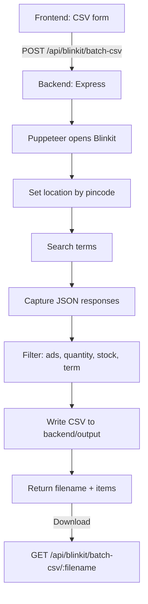
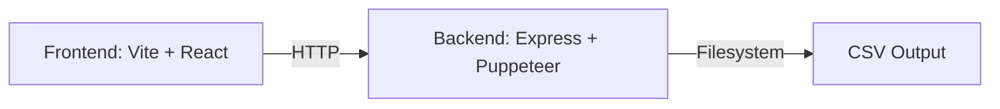

# quick scraper

**inkit-only scraping and CSV export tool with a small frontend to generate and download results.

## Requirements

- Node.js: 18.18+ (recommended 20.x)
- npm: 9+
- nvm (optional, recommended)

### nvm

```bash
nvm install 20
nvm use 20
```

## Install nvm

### macOS / Linux

```bash
curl -o- https://raw.githubusercontent.com/nvm-sh/nvm/v0.39.7/install.sh | bash
```

Then reload your shell:
```bash
source ~/.zshrc
```

Verify:
```bash
nvm --version
```

### Windows

Use nvm-windows:
```bash
winget install CoreyButler.NVMforWindows
```

Then open a new terminal and verify:
```bash
nvm --version
```

## Quick Start

```bash
npm install
npm run dev
```

This starts:
- Backend: `http://localhost:6001`
- Frontend: `http://localhost:5173`

## Manual Start

Backend:
```bash
cd backend
npm install
npm run dev
```

Frontend:
```bash
cd frontend
npm install
npm run dev
```

## Environment

Optional (frontend):
- `VITE_API_URL` (default: `http://localhost:6001`)

Optional (backend):
- `PORT` (default: `6001`)
- `FRONTEND_URL` (default: `http://localhost:5173`)
- `PUPPETEER_EXEC_PATH` (if Chromium is not on PATH)

## How It Works

### Flow Diagram



### Architecture Overview



## Tech Overview

- Frontend: React + Vite + Tailwind
- Backend: Node.js + Express + Puppeteer
- CSV generation: local filesystem
- Data source: Blinkit web search responses

## API

### Generate CSV
`POST /api/blinkit/batch-csv`

Body example:
```json
{
  "pincodes": "575006",
  "searchTerms": "onions",
  "quantities": "1kg"
}
```

### Download CSV
`GET /api/blinkit/batch-csv/:filename`

## Important Components

### Backend
- `backend/server.js`
  - API routes
  - CSV download handler
  - CORS + static assets
- `backend/blinkit/batchCsvService.js`
  - Main batch flow
  - Filtering (ads, quantity, out-of-stock, term matching)
  - CSV writer
- `backend/blinkit/searchHelpers.js`
  - JSON extraction
  - Ad detection
- `backend/blinkit/set-location.js`
  - Pincode-based location selection

### Frontend
- `frontend/src/App.tsx`
  - CSV form
  - Download button
  - Results list
- `frontend/src/components/ProductList.tsx`
  - Product card grid

## Code Structure

```
quick-scraper/
├── backend/
│   ├── blinkit/
│   │   ├── batchCsvService.js
│   │   ├── searchHelpers.js
│   │   └── set-location.js
│   ├── output/                 # CSV files
│   ├── server.js
│   └── package.json
├── frontend/
│   ├── src/
│   │   ├── App.tsx
│   │   ├── components/
│   │   └── assets/
│   ├── vite.config.ts
│   └── package.json
├── package.json                # root dev scripts
└── README.md
```

## Notes

- Results depend on **inkit availability and location.
- Accuracy is best-effort; UI scraping can change if the website changes.

